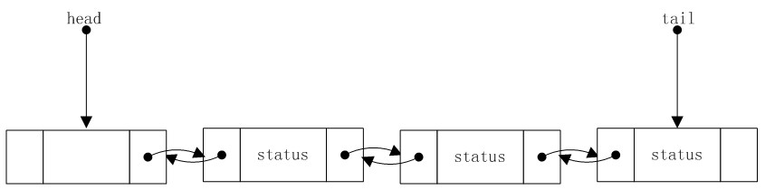
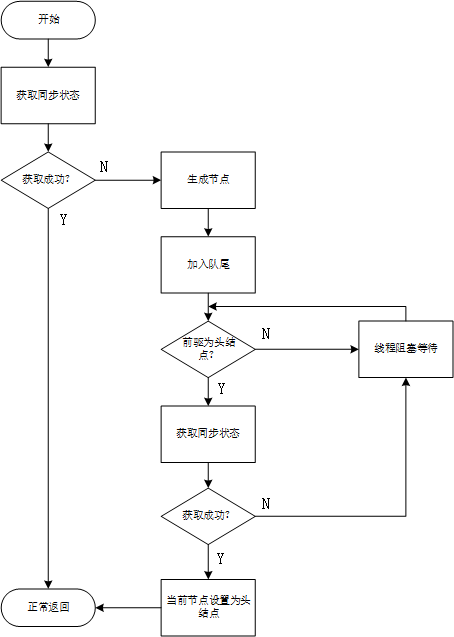
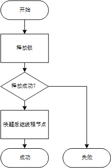

# JDK源码之AbstractQueuedSynchronizer

## 引子

AbstractQueuedSynchronizer，简称为 AQS，是一个用于构建锁和同步器的框架。可以说是 j.u.c 中的基石，许多类都是基于它来进行构建的：CountDownLatch、ReentrantReadWriteLock、SynchronousQueue 和 FutureTask。

这些重要类的核心功能基本都是直接委托 AQS 进行实现的。本文我们基于 **JDK1.8** 版本从实现的方式解剖一下其内部实现机制。

<!--more-->

## 机制

简单说，就是AQS内部维持了一个 state 和一个线程等待队列。

而诸如CountDownLatch等锁都是根据 state 来判断线程是否可以获取锁，如果不能，线程如何排到线程等待队列中。

这些问题在AQS内部得到了解决。

其获取锁与释放锁的机制使用伪代码可以描述如下：

```Java
boolean acquire() throws InterruptedException {
    while 当前状态不允许获取锁操作 {
    	if 需要阻塞获取请求 {
    		if 当前线程不在队列中 {
    			插入队列；
    			阻塞当前线程；
    		}
    	}
    	else
    		返回失败；
    }
    更新同步器状态
    if 线程在队列中 {
        移出队列
    }
    返回成功
}

void release(){
    更新同步器状态；
    if 新状态允许某个被阻塞的线程获取成功
        解除队列中一个或者多个线程的阻塞状态
}
```

AQS 支持独占式的获取以及共享式的获取。

### 数据结构

#### 同步队列

当共享资源被某个线程占有时，其他请求该资源的线程将会被阻塞，从而进入同步队列。

**在 AQS 中，同步队列是一个严格的FIFO队列。**

该同步队列是用一个双向链表实现的。

其结构如图所示。




链表中的结点元素为 Node，一个空 Node 作为链表的头结点，有一个 tail 指针指向链表的尾结点。

Node 内部自然有两个指针：prev 和 next，同时还有一个与当前Node绑定的线程。

头结点是一个傀儡节点，后面会被Node线程代替。

只有排在队头的线程才允许竞争锁。

```Java
/**
 * 指向当前节点的前续结点，只有成功获取结点才有可能成为头结点
 */
volatile Node prev;

/**
 * 指向当前节点的后续节点
 */
volatile Node next;

/**
 * 使当前节点入队的线程
 */
volatile Thread thread;
```

在 Node 内部维持了一个状态变量 `status`，可以取值如下：

```Java
/** Node节点的状态 */
volatile int waitStatus;
/** 表示当前线程已经被取消 */
static final int CANCELLED =  1;
/** 表示当前后继线程需要被唤醒 */
static final int SIGNAL    = -1;
/** 表示当前线程正在进行条件等待 */
static final int CONDITION = -2;
/** 表示下一次共享式获取应该无条件的传播 */
static final int PROPAGATE = -3;
```

- SIGNAL 当前Node的后继节点被阻塞，所以当前节点必须在释放锁或者被取消时，唤醒其后继节点。
- CANCELLED：当前Node因为被中断或者超时而被取消。一个线程如果被取消后，将不再阻塞获取锁。
- CONDITION：当前Node在一个条件队列上，而不是同步队列，除非该节点被转移到同步队列中，此时该节点的状态将会被置0
- PROPAGATE：一次共享释放锁应该传播到其他节点。
- 0：非以上状态


#### 状态

```Java
/**
 * The synchronization state.
 */
private volatile int state;
```

该变量表示同步器中的状态，可以用该整数表示任意状态，在不同的锁实现中该状态有不同的含义。

以上介绍了AQS中的主要的元素，下面结合上述两种元素来看看在AQS中独占锁和共享锁是怎么实现的。

### 独占锁

#### 获取

```Java
public final void acquire(int arg) {
    if (!tryAcquire(arg) && acquireQueued(addWaiter(Node.EXCLUSIVE), arg))
        selfInterrupt();
}
```

该方法会通过独占式的方法获取锁，注意该方法不接受中断，最后如果执行失败，会自己中断。

if 条件语句中其实包含的是两个步骤：

1. 尝试直接获取锁，获取成功，返回；获取失败，进入下一步
2. 线程阻塞排到同步队列中，直到被唤醒，如果成功，返回；如果失败，阻塞当前线程。

我们看下线程是如何排到同步队列中的。

```Java
private Node addWaiter(Node mode) {
    Node node = new Node(Thread.currentThread(), mode);
    // Try the fast path of enq; backup to full enq on failure
    Node pred = tail;
    if (pred != null) {
        node.prev = pred;
        if (compareAndSetTail(pred, node)) {
            pred.next = node;
            return node;
        }
    }
    enq(node);
    return node;
}
```

在 addWaiter 方法中传入的值为 Node.EXCLUSIVE，表示 node 是在独占模式下等待。

```Java
/** Marker to indicate a node is waiting in exclusive mode */
static final Node EXCLUSIVE = null;
```

这里使用的 Node 的构造函数如下：

```Java
Node(Thread thread, Node mode) {     // Used by addWaiter
    this.nextWaiter = mode;
    this.thread = thread;
}
```

如果 pred 不为 null，代表队列不为空，则使用 CAS 操作插入到队尾。这里有个问题：CAS是一个乐观锁，如果执行失败怎么办（也就是说在执行入队的过程中，另外一个线程也同时也在执行入队操作）？

没关系，最后一步调用 enq 方法会保证最终入队成功。

```Java
private Node enq(final Node node) {
    for (;;) {
        Node t = tail;
        if (t == null) { // Must initialize
            if (compareAndSetHead(new Node()))
                tail = head;
        } else {
            node.prev = t;
            if (compareAndSetTail(t, node)) {
                t.next = node;
                return t;
            }
        }
    }
}
```

这个方法综合考虑了两种情况：1.队列为空；2.前面入队失败。

- 情况1：CAS设置一个空 Node 作为链表头，这个时候就可以与情况2进行统一处理了。
- 情况2：CAS操作入队。

以上算是完成了线程入队操作，但是等等，不是说要把线程阻塞么？现在没有看到任何阻塞的操作呀？

继续往下看。

回头看看最初的 acquire 方法，在 addWaiter 成功后，紧接着要执行的是 acquireQueued 方法。

这个方法顾名思义，就是从前面的同步队列里面取出元素来获取锁呀。

不是说获取锁失败了么？怎么又要取出线程继续获取锁么，这不是又要有一次获取锁失败么？

不一定。

假设如果线程获取失败，就直接将其放到队列中阻塞等待。

想象一个场景：

>  时刻 t ，线程B占有锁，同步队列为空。
>
> 时刻 t+1，线程A获取锁，线程B也开始释放锁

在这种情况下，假设线程B刚释放锁（虽然释放锁时，会唤醒同步队列中的后继元素，但是因为队列是空闲的，所以也无从唤醒）A排到队中，这个时候锁是空闲的，但是A已经在阻塞等待状态了，谁去唤醒它呢？不知道，也许将会永远等待下去。

虽然场景有点极端，但是在高并发的情况下，未必就不会发生这种情况。

但是要在 A 刚排到阻塞队列后就出队，就不会有这种情况发生。

我们细看下 acquireQueued  里面干了什么？

```Java
final boolean acquireQueued(final Node node, int arg) {
    boolean failed = true;
    try {
        boolean interrupted = false;
        for (;;) {
            //获取该节点的前续节点
            final Node p = node.predecessor();
            //如果该节点的前续节点是头结点，则说明它是第一个等待的线程，此时再去获取一次锁
            if (p == head && tryAcquire(arg)) {
                //如果获取成功，则将其置为头结点
                //由于只有一个线程能够获取到资源，因此设置头节点的时候，不需要 CAS 操作，直接设置即可。
                setHead(node);
                p.next = null; //拿到资源后，将原头节点从队列中完全拿出来，让虚拟机回收资源
                failed = false;//成功拿到资源
                return interrupted;
            }
            //如果该节点不是同步队列中第一个等待的线程，或者获取锁失败，此时就能甘心被阻塞了
            if (shouldParkAfterFailedAcquire(p, node) &&
                parkAndCheckInterrupt())
                interrupted = true;
        }
    } finally {
        if (failed)
            cancelAcquire(node);
    }
}
```

注意上面使用的 setHead 方法。此方法在排到队中的线程获取到锁之后，才被调用。

```Java
private void setHead(Node node) {
    head = node;
    node.thread = null;
    node.prev = null;
}
```

更改当前的头指针指向 node 节点，但是此时 node 绑定的 Thread 和 prev指针都变为空，所以依然是一个傀儡节点。

**也侧面证明了，只有head节点的next节点，也就是排到队首的线程才有机会获取锁。**


```Java
private static boolean shouldParkAfterFailedAcquire(Node pred, Node node) {
    //获取前任的状态
    int ws = pred.waitStatus;
    if (ws == Node.SIGNAL)
        /*
         * 如果前任节点的状态已经被设置成SIGNAL，表示当前节点需要阻塞，等待被前节点唤醒
         */
        return true;
    if (ws > 0) {
        /*
         * 如果前任已经取消等待了，通过循环将当前节点之前所有取消状态的节点移出队列
         */
        do {
            node.prev = pred = pred.prev;
        } while (pred.waitStatus > 0);
        pred.next = node;
    } else {
        /*
         * 前节点状态是其他状态时，需要设置前节点为SIGNAL。
         */
        compareAndSetWaitStatus(pred, ws, Node.SIGNAL);
    }
    return false;
}
```

最终调用 LockSupport 的方法挂起本线程。

```Java
private final boolean parkAndCheckInterrupt() {
    LockSupport.park(this);
    return Thread.interrupted();
}
```

这就是整个独占锁的获取过程。

获取锁的过程总结如下：

1. 先使用 tryAcquire 方法直接去获取锁，成功则直接返回，不成功，进入步骤2
2. 将当前线程包装成为 Node 节点排到同步队列中，如果在队列中的前节点是 head 节点，则再次使用 tryAcquire 方法获取锁，成功进入步骤3，失败步骤4
3. 更改头结点，返回
4. Node 节点进入同步队列被挂起，等待唤醒。

#### 释放

如果加锁的逻辑是：排队-->挂起，那么释放锁的逻辑就是：唤醒-->出队。

其实释放主要做的就是唤醒即可，因为线程都在竞争锁的过程中阻塞，所以一旦被唤醒，该线程就又开始竞争锁了，只要该线程能够再次获取到锁资源，则可以自动出队。

所以需要从head节点开始唤醒线程。

release 方法的逻辑：

1. 释放锁
   1. 成功：唤醒后继节点
   2. 失败：返回 false

所以关键就在：如果释放锁成功，怎么唤醒后继节点。

```Java
public final boolean release(int arg) {
    if (tryRelease(arg)) {
        Node h = head;
        //判断后面有没有节点需要它来唤醒
        if (h != null && h.waitStatus != 0)
            unparkSuccessor(h);
        return true;
    }
    return false;
}

private void unparkSuccessor(Node node) {
        int ws = node.waitStatus;
        if (ws < 0)
            //更新Node状态为0，意思是不参与排队了，更新失败也不影响，所以并没有使用循环CAS
            compareAndSetWaitStatus(node, ws, 0);
        Node s = node.next;
        if (s == null || s.waitStatus > 0) {
            s = null;
            for (Node t = tail; t != null && t != node; t = t.prev)
                if (t.waitStatus <= 0)
                    //从后往前找，找最后一个不是取消状态或者初始化状态的节点
                    s = t;
        }
        if (s != null)
           	//执行唤醒
            LockSupport.unpark(s.thread);
    }
```

可以看到上面有一个很巧妙的实现，如果当前节点的后继节点为空，或者后继节点已经取消，并不是从后继节点开始往后遍历节点，而是从 tail 指向的尾结点开始找，找最后一个不是取消状态或者初始化状态的节点，也就是从前往后数第一个不是取消状态或者初始化状态的节点。

原因何在？

细看源码，就会发现其实我们在 acquireQueued   方法里面是有一个 try...finally...块的。

```Java
boolean failed = true;
try {
    其他操作
    if (shouldParkAfterFailedAcquire(p, node) && parkAndCheckInterrupt())
          interrupted = true;
} finally {
    if (failed)
        cancelAcquire(node);
}

```

如果线程被中断了，parkAndCheckInterrupt 方法是可以检测出来的，这个时候会走到 finally 块中，调用 cancelAcquire 方法取消该线程竞争锁。

这就需要看看 cancelAcquire 里面发生了什么了？

```Java
private void cancelAcquire(Node node) {
    // Ignore if node doesn't exist
    if (node == null)
        return;

    node.thread = null;

    // 略过所有已经取消的前续节点，找到第一个没有被取消的前续节点，将指针指向它
    Node pred = node.prev;
    while (pred.waitStatus > 0)
        node.prev = pred = pred.prev;
    Node predNext = pred.next;

    // Can use unconditional write instead of CAS here.
    // After this atomic step, other Nodes can skip past us.
    // Before, we are free of interference from other threads.
    node.waitStatus = Node.CANCELLED;

    // 如果排到队尾，直接移出队列
    if (node == tail && compareAndSetTail(node, pred)) {
        compareAndSetNext(pred, predNext, null);
    } else {
        // If successor needs signal, try to set pred's next-link
        // so it will get one. Otherwise wake it up to propagate.
        int ws;
        if (pred != head &&
            ((ws = pred.waitStatus) == Node.SIGNAL ||
             (ws <= 0 && compareAndSetWaitStatus(pred, ws, Node.SIGNAL))) &&
            pred.thread != null) {
            Node next = node.next;
            if (next != null && next.waitStatus <= 0)
                //使用CAS方式将前续节点的next节点更改为当前节点的 next节点
                compareAndSetNext(pred, predNext, next);
        } else {
            unparkSuccessor(node);
        }

        node.next = node; // help GC
    }
}
```

因为在队列中的结点随时有可能被中断，被中断的结点的waitStatus设置为CANCEL,而且它会被踢出CLH队列，如何个踢出法，就是它的前趋结点的next并不会指向它，而是指向下一个非CANCEL的结点,而它自己的next指针指向它自己（将自己踢出，并让 GC 回收）。一旦这种情况发生，如何从头向尾方向寻找继任结点会出现问题，因为一个CANCEL结点的next为自己，那么就找不到正确的继任接点，这就解释了为什么要从尾结点开始向前遍历的问题了。

独占锁获取流程图如下：



独占锁的释放流程图如图：



 

### 共享锁

#### 获取

```Java
private void doAcquireShared(int arg) {
    final Node node = addWaiter(Node.SHARED);
    boolean failed = true;
    try {
        boolean interrupted = false;
        for (;;) {
            final Node p = node.predecessor();
            if (p == head) {
                int r = tryAcquireShared(arg);
                if (r >= 0) {
                    setHeadAndPropagate(node, r);
                    p.next = null; // help GC
                    if (interrupted)
                        selfInterrupt();
                    failed = false;
                    return;
                }
            }
            if (shouldParkAfterFailedAcquire(p, node) &&
                parkAndCheckInterrupt())
                interrupted = true;
        }
    } finally {
        if (failed)
            cancelAcquire(node);
    }
}
```


#### 释放


（未完。。。。）

## 参考资料

1. 《Java并发编程实战》
2. [https://blog.wuwii.com/java-aqs.html](https://blog.wuwii.com/java-aqs.html)


