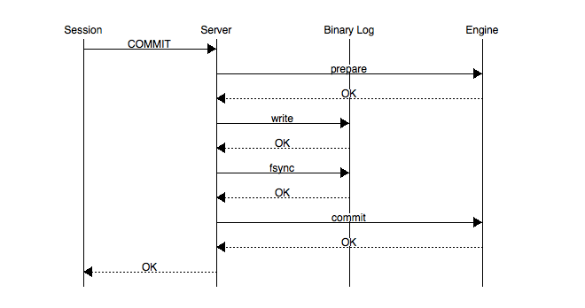

[上一篇文章](https://leexuehan.github.io/2019/07/18/MySQL%E5%AD%A6%E4%B9%A0%E7%AC%94%E8%AE%B0%EF%BC%88%E4%B8%80%EF%BC%89/)
讲我们对一个表执行查询的时候，MySql底层发生了什么。
这篇文章主要记录在对一张表执行字段更新的时候，MySQL 底层是怎么运作的。

<!--more-->

#### 更新表字段

假设我们现在有一张表 T，要更新 ID 为 1 所在的那一行的一个整型字段 c （从 1 变为 2）。

会点简单的 SQL 语句基础的都知道，我们应该使用下面一行语句：

> update T set c = c+ 1 where ID = 1

我们再把上一篇文章中的图拿过来。

我们顺着上一篇文章的流程来分析：

1.连接器

首先请求走到了连接器，与服务端建立连接、获取权限。

2.查询缓存

上一篇文章我们知道：缓存中存储的是**查询语句**和**查询结果**组成的键值对。

如果在我们执行update语句之前，有人执行过对该字段的查询语句，则此时查询缓存会如图：

因为这是个查询缓存，而我们所执行的是一个 update 语句，所以显然缓存中是没有的，所以接下来会进入分析器进行分析语句类型。

**注意：最新的 MySql 版本中，查询缓存已经沦为历史。后面我们就知道了，这个缓存比较鸡肋，食之无味，弃之可惜**。

3.分析器

到分析器这，才会分析该语句到底是什么类型的语句，要进行什么操作。

此处分析为 update，MySQL为了防止**缓存不一致**的现象产生，则会使得查询缓存中所有关于 T 表的 key-value 对失效。

分析完语句的词法和语法之后，马上进入优化器部分。

4.优化器

此时优化器看到了是以 ID 为条件进行筛查的，所以决定使用 ID 这个索引。

先找到 ID=1 这一行。

将这行的 c 字段内容读到内存 buffer pool 中，进行更新（这也是一种常见的更新套路：从磁盘中读出这个字段的值到内存，更新内存中这个字段的内容，然后再写回到磁盘）。

此时就进入本文的核心部分，将字段 c 的值读到内存中，更新字段 c 的值之后，接下来会发生什么？

这就涉及到两个重要的日志模块：redo log 和 binlog。

在介绍这两个模块之前，不妨设想一下，如果是让我们来实现这个更新过程，我们会怎么做？

我觉得主要应该考虑下面两方面的问题：

一、性能问题

更新的过程要快，就像我们去餐馆吃饭，肯定是希望服务员能够以最快的速度把菜端上来，不能让我们老等着。

二、健壮性问题

要想到各种异常情况，比如更新的时候，MySQL服务器挂掉了重启怎么办？我往我的银行卡里面转账时，不能因为更新我银行卡余额的时候，银行的数据库服务器挂掉了，就不给我的账户余额加钱。

或者我不小心误删了或者误改了什么东西，现在想纠正过来，不能不给我机会是吧。

这些问题 MySQL 是怎么解决的呢？

针对性能问题，它使用了 redo log 日志模块。

##### redo log

想象一下，如果MySQL的一张表里存储了100w条数据，这个时候，我只要对其中的一条进行更改。

按照既有套路，肯定是先找到那条记录，然后再进行更新，写入新值到数据文件中。

可是即使数据库在查询那条数据时，做了该做的优化，但是从 100w 条数据里去找到那条记录还是比较耗时的操作。

所以，MySQL 的 InnoDB 存储引擎弄了一个 redo log 模块。

这个模块相当于一个临时记账小本本，我来不及处理，先记到小本本上，等有空了，我再从小本本整理到我的数据库里。

那么这个“小本本”长什么样？

它是物理日志，是一组直接存储在磁盘上的文件。这个组数是固定大小的，一组每个文件的大小一般是1GB，如果我们这组总共有 4 个文件，那么这个小本本的大小为 4GB。

这个“小本本”记录的是什么？

记录的是那些表做了哪些改动，比如针对我们上面的场景就是“在表 T 上更新 c 字段的值为 2”。

小本本写满了怎么办？

这个问题问得好，小本本的数据结构类似一个环形数组，我们可以理解为只有 4 页纸的笔记本，如图：

write pos 表示当前记录的位置。

check point 表示当前要擦除的位置。

它们都是顺时针往后推移，并且是循环的。

也就是说小本本第 4 页纸都写满了，可以擦掉第一页的内容继续写，但是在擦掉之前记录的内容前，要更新内容到数据文件（要不然不是白记了么）。

有了这个小本本，服务器就不怕重启了，重启之后服务器一看小本本。就知道自己挂之前，用户做了什么操作，如果上次有什么操作没有做完，则继续做完就是了。

这种能力叫 crash-safe。

但是注意：这种通过 redo log 实现 crash-safe 的能力**只有 InnoDB引擎**才具备，其他存储引擎是没有这个能力的。

至此，第一个问题，我们算是有了一个解决方案，有了记账小本本，我们会保证很快响应用户的操作，而这个方案也顺便解决了重启恢复的问题。

##### binlog

第二个问题：健壮性问题。

我们想实现能够恢复到半个月之前（或者更早）任意一秒数据库的状态怎么办？

有人说不是有 redo log 么。但是 redo log 是循环写入的，也就是说如果 redo log 满了之后，后面的添加的新数据就会覆盖老数据了。

比如这个小本本只能记录一天的操作，那么昨天的操作肯定已经被今天的操作覆盖了。

这个时候，我们是无法得知昨天之前，我们对数据库做了什么的。

所以要想实现恢复功能，还需要另外一个机制：binlog。

MySQL 在 Server 层实现了一个 binlog 日志模块，这个模块是所有引擎可以共享使用的。

binlog 不是循环写的，而是**追加式**的。也就是说服务器会不断往一个 binlog 文件写，直到文件大小达到一定值，然后再继续写入下一个文件。

binlog 是什么形式的，记录了什么？

binlog 是一个二进制文件，里面记录了类似 sql 的东西，所以如果涉及多表修改的话，一个更新动作可能会对应多行 binlog。

有了以上问题的思考，我们再来看下到底是怎么执行更新的。

首先来看张流程图：

上图“写入新行”之前的流程好理解。但是为什么在“新行更新到内存”后，不是简单顺序执行：写入 redo log，写入 binlog 或者 写入 binlog，写入 redo log 呢？

这就涉及到了事务中常见的一种套路：两阶段提交（2PC，2 phase commit）。

设想一下：

如果我们按照下面的流程实现：

更新内存中 c 字段的值 ---> 写入 redo log ----> 写入 binlog

那么在执行完第 2 步后，数据库服务器 crash 了。

这个时候就会出现 redo log 记录的操作会领先 binlog 一步，服务器重启后，一查 redolog 中记录了要把 c 的值改为 2，所以会把 c 的值恢复为 2，
而 binlog 没有记录这样的动作，如果我们要使用 binlog 来恢复一个临时库的话，自然就会少一次更新的操作，造成我们恢复的临时库的内容和原库的值**不一致**。

那么如果按照下面流程实现呢：

更新内存中 c 字段的值 ---> 写入 binlog ----> 写入 redo log

同样的场景发生：在执行完第 2 步后，数据库服务器 crash 了。

这个时候 binlog 会比 redo log 多一次更新，数据库服务器重启后，因为 redo log 中没有记录更新 c 的值的操作，所以不会对c进行任何操作，原库中 c 的值仍然是1。
而binlog中却记录。那么如果哪一天，我们要恢复到崩溃那一刻的临时库的话，就会出现临时库中 c 的值已经为 2 了（因为binlog中有记录）。

所以，结论就是不能简单地顺序执行。

此时我们再回头看所谓的**两阶段提交**是否解决了该问题。

时序图如下：

此处的 engine 可以理解为 redo log。

第一阶段写入 redo log，此时 redo log 处于 prepare 阶段，同时生成了一个事件id（xid），告诉 Server，“我已经准备好更新了”。

接下来 Server 会继续写入 binlog，同时会将上一步生成的xid告诉binlog，如果binlog 写入成功，那么就进入第二阶段。

第二阶段：Server 通知 redo log，“好了，你可以提交了”，redo log 执行提交事务操作，完成。

这个时候我们来想想异常场景的发生：

###### 写入 redo log 让它处于 prepare 状态时 crash：

binlog没有任何更改记录，redo log也没有提交，所以重启之后，redo log是没有记录更改的，与 binlog 保持一致。不会出现重启后的
数据库和恢复的临时数据库的值不一致的情况。

####### 写入binlog 时crash

同理，因为没有写入 binlog 成功，也没有更改 redo log 成功，所以不会出现数据不一致的情况。

####### 写入binlog成功后crash

此时 binlog 已经有了更改记录，但是redo log 并没有。
数据库服务器重启后，会**读出binlog中的记录的事件id**，告诉 redo log要执行更改，提交事务操作。

所以，通过以上异常场景的分析，这个两阶段提交的机制确实能保证事务的正常执行，数据的一致状态。

##### 疑问

1.为什么 binlog 之后，还需要有 redo log？为什么 binlog 没有 crash-safe 能力？

答：关于这个问题，在丁奇的[这篇文章](https://www.infoq.cn/article/M6g1yjZqK6HiTIl_9bex)里面给出了回答，简单来说就是binlog首先最初就不是用来
做 crash-safe的，然后就是单靠 binlog 无法保证事务能够在崩溃状态下提交，如果想完善的话，只能再搞出一个 redo log 类似的东西出来。

2.能不能只要 redo log 不要 binlog？

答：只要redo log 当然是不行的，只有一个几页纸的小本本，用不了多长时间就会写完擦掉重写，而binlog是一个陈年流水账，会记录相当长时间用户进行的
操作，所以要想恢复几个月之前的备份，只能查陈年流水账。

#### 参考资料

1. 丁奇《MYSQL 45 讲》
2. [https://www.infoq.cn/article/M6g1yjZqK6HiTIl_9bex](https://www.infoq.cn/article/M6g1yjZqK6HiTIl_9bex)
3. [https://hoxis.github.io/mysql-zhuanlan-02-redolog-binlog.html](https://hoxis.github.io/mysql-zhuanlan-02-redolog-binlog.html)