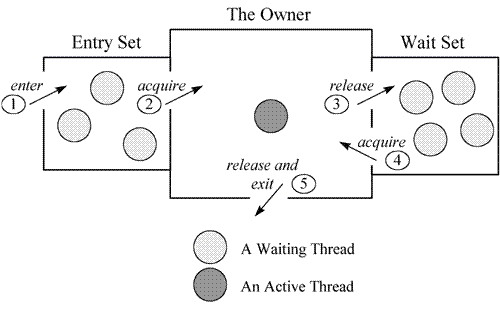

# Java 并发编程之Notify 和 Wait 

## notify 和 wait 解决什么问题

notify 和 wait 解决的是线程之间的协作问题。

假设线程 `A` 获得了 CPU 的使用权，但是还没等到需要继续进行下去的资源（比如数据库资源、磁盘资源），这个时候继续占用 CPU，并不是一个很有效率的选择，于是这个时候可以使用线程间协作。

可以开启另外一个线程 `B` 单独请求这些资源，而自己可以等待（wait），等到线程 `B` 完成了任务，就可以通知（notify）线程 `A`。

这样，两个线程就可以亲密无间的合作了。

## notify 和 wait 的机制是什么

### 线程的状态

一个线程的状态有五种：new、runnable、running、blocked、dead。

这五种状态之间的转换关系如图。

<div align=center>

以 Java 语言为例。

- new——使用 new 关键字创建线程，如 new Thread{.....}，则该线程此时的状态即为 `new` 状态。
- runnable——创建好线程对象之后，调用其 start() 方法，此时开始等待获取 CPU 的使用权，此为 `runnable` 状态。
- running——获取了 CPU 的使用权后，正在占用（当然也并非独占） CPU 执行任务，此时为 `running` 状态。
- blocked——线程任务还没有执行完，由于某种原因让出 CPU  的使用权（比如进行IO操作、网络操作），此时变为 `blocked` 状态。
- dead——线程执行完毕或者执行过程中出现异常导致“线程跑飞”的现象出现，此时为 `dead` 状态。

关于这五种状态，blocked 状态理解起来稍微困难一点，接下来对其进行简单探讨。

### blocked 状态

正在执行的进程由于发生某时间（如I/O请求、申请缓冲区失败等）暂时无法继续执行。此时引起进程调度，OS把CPU 分配给另一个就绪进程，而让受阻进程处于暂停状态，一般将这种状态称为 blocked 状态。

在 Java 里面提供了几种方法来实现阻塞：

1. sleep 方法。

   此方法设置睡眠时间，在睡眠时间内，该线程一直处于 blocked 状态当睡眠时间到后，在睡眠时间到后，线程自动转为 runnable 状态，等待 OS 的调度。

2. wait 方法。

   该方法的机制文章接下来的部分会重点讲解。

3. yield 方法。

   暂停当前正在执行的线程对象，把执行机会让给相同或者更高优先级的线程，也称为线程礼让。

   **严格来说，该方法并不会使当前线程阻塞，而是将线程置于 runnable 状态，随时可能再次分配到 CPU 的使用权。**

4. join 方法

   在当前线程中调用另外一个线程的 join 方法，使当前线程进入 blocked 状态，直到另外一个线程执行结束后，当前线程才可以转为 runnable 状态。

5. suspend/resume 方法

   两个方法配套使用，使当前线程进入 blocked 状态，但是不会自动转为 runnable，而是必须调用当前线程的 resume 方法才可以实现。

   这两个方法在 JDK1.5 中已经废除，有死锁之可能。

### wait 

#### 对象 monitor

> Synchronizations built around an internal entity known as the intrinsic lock or monitor lock. (The API specification often refers to this entity simply as a “monitor.”).
>
> Every object has an intrinsic lock associated with it. By convention, a thread that needs exclusive and consistent access to an object’s fields has to acquire the object’s intrinsic lock before accessing them, and then release the intrinsic lock when it’s done with them.

这是官方给出的关于 Java 中的对象 monitor 的解释。

总结为以下几点：

1. synchronize 机制的实现是建立在 monitor lock（监视器锁）上的
2. 每个对象都有一个与之关联的监视器锁
3. 一个需要对对象进行独占访问或者一致性访问的线程，首先必须获取这把锁，访问完成之后，要释放这把锁

关于 Monitor 的设计与实现方法，参考[探索 Java 同步机制](https://www.ibm.com/developerworks/cn/java/j-lo-synchronized/index.html)，已经分析的很深入了。这里只就 Java 的 Monitor 一个简单了解。

Java 的 Object 类本身就是一个监视器对象（所以任何一个 Java 对象都能当做锁使用），下图展示了 Java Monitor 的工作原理。

<div align=center>

线程如果获取监视锁成功，则成为该监视对象的 owner，在任一时刻，监视对象只属于一个活动线程（Owner），该线程可以调用 wait 方法自动释放该监视锁，进入等待状态。

Entry Set 和 Wait Set 中的线程都可能成为该监视对象的 owner。只有 release and exit 才真正离开该监视对象。

先看关于 wait 方法的官方介绍：

> Causes the current thread to wait until another thread invokes the notify() method or the notifyAll() method for **this object**.

翻译过来就是：wait 方法会使当前线程处于等待（blocked）状态，直到另外一个线程调用这个对象的 notify 或者 notifyAll 方法。

需要注意的是：**被唤醒的线程还需要跟其他在 Entry Set  中的线程进行竞争获取对象监视器锁，而不具有其他的特殊优先级。**

我们再看关于 notify 方法的官方介绍：

> Wakes up a single thread that is waiting on this object's monitor.
>
> If any threads are waiting on this object，one of them is chosen to  be awakened.
>
> The choice is arbitrary and occurs at the discretion of the implementation.

翻译过来就是：唤醒正在等待这个对象监视器的**单个**线程，如果有多个线程同时在等待这个对象锁，则任意选择其中的一个唤醒。

有了前面的部分作为基础，我们不难理解上面关于这两个方法的介绍。

说白了，wait 方法就是使线程进入 wait set，而 notify 方法就是使线程从 wait set 中出来，再次变成这个对象的 owner。

所以，如果像下面这样使用 wait 方法，就会抛出 IllegalMonitorStateException 异常：

```
	public void testWait(){
        System.out.println("Start-----");
        try {
            wait(1000);
        } catch (InterruptedException e) {
            e.printStackTrace();
        }
        System.out.println("End-------");
    }
```

之所以出现这个异常，就是因为 wait 方法没有在 synchronize 块里。

为什么呢？因为如果使用 wait 方法，必须是在获取到对象锁，成为对象的 owner 的前提之下的，而我们上面的方法里面，还没有获取到对象的锁，所以后面就无法直接进入对象的 wait set。

notify 也同理，必须是获取到对象监视器锁之后，才能唤醒其他在等待对象监视器锁的线程。

官方的原话是：

> The method should only be called by a thread that is the owner of this object's monitor.

### wait vs sleep

wait 与 sleep 方法都会使线程进入 blocked 状态，但是 wait 方法会进入对象监视器的 Wait Set，也就是已经释放锁了，而 sleep 方法则不会释放监视器锁，仅仅是释放了 CPU 的使用权。

## 使用 notify 和 wait 方法时需要注意什么

### 信号丢失（Missed Signals）和虚假唤醒（spurious wakeups）

先来说信号丢失的问题。

```
public class MonitorObject{
}

public class MyWaitNotify{

  MonitorObject myMonitorObject = new MonitorObject();

  public void doWait(){
    synchronized(myMonitorObject){
      try{
        myMonitorObject.wait();
      } catch(InterruptedException e){...}
    }
  }

  public void doNotify(){
    synchronized(myMonitorObject){
      myMonitorObject.notify();
    }
  }
}
```

如果我们使用上面的代码进行线程间通信，则可能会有问题。

如果一个线程先于被通知线程调用wait()前调用了notify()，等待的线程将错过这个信号，在某些情况下，这可能使等待线程永远在等待，不再醒来，因为线程错过了唤醒信号。

所以，为了避免信号丢失，可以使用如下方法做出改进：

```
public class MyWaitNotify2{

  MonitorObject myMonitorObject = new MonitorObject();
  boolean wasSignalled = false;//增加全局信号量

  public void doWait(){
    synchronized(myMonitorObject){
      if(!wasSignalled){
        try{
          myMonitorObject.wait();
         } catch(InterruptedException e){...}
      }
      //clear signal and continue running.
      wasSignalled = false;
    }
  }

  public void doNotify(){
    synchronized(myMonitorObject){
      wasSignalled = true;
      myMonitorObject.notify();
    }
  }
}
```

doWait()方法在调用wait()前会检查wasSignalled变量，此时如果 doNotify 方法先被调用，则 doWait 方法将不再会调用 wait 方法进入阻塞状态。

再来说说虚假唤醒的问题。

在网上查了一番资料，没有搞清楚所以然，只了解了大概（有待后续深究）。简言之，就是因为某种操作系统线程通信的原因，线程在调用 wait 方法的情况下，会莫名其妙地醒来，而不是因为有线程调用了其 notify 或者 notifyAll 方法。

所以，在这种情况下，使用 if 进行判断就不再可取，因为 wait 醒来之后，if 里面的判断条件**可能依然不成立**。

一个规避方法就是：将其放到 while 循环里，即使莫名其妙醒来，也会因为唤醒条件不成立，再次阻塞。

```
public class MyWaitNotify3{

  MonitorObject myMonitorObject = new MonitorObject();
  boolean wasSignalled = false;

  public void doWait(){
    synchronized(myMonitorObject){
      while(!wasSignalled){
        try{
          myMonitorObject.wait();
         } catch(InterruptedException e){...}
      }
      //clear signal and continue running.
      wasSignalled = false;
    }
  }

  public void doNotify(){
    synchronized(myMonitorObject){
      wasSignalled = true;
      myMonitorObject.notify();
    }
  }
}
```


（全文完）


## 参考资料

1. [Java并发编程：线程间协作](https://www.cnblogs.com/paddix/p/5381958.html)
2. [OS中阻塞与挂起的区别&sleep()的实现原理](https://iamxpy.github.io/2017/09/20/OS%E4%B8%AD%E9%98%BB%E5%A1%9E%E4%B8%8E%E6%8C%82%E8%B5%B7%E7%9A%84%E5%8C%BA%E5%88%AB-sleep()%E7%9A%84%E5%AE%9E%E7%8E%B0%E5%8E%9F%E7%90%86/)
3. [探索 Java 同步机制](https://www.ibm.com/developerworks/cn/java/j-lo-synchronized/index.html)