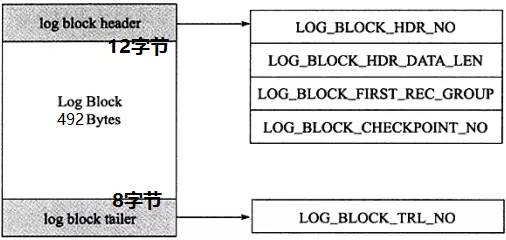
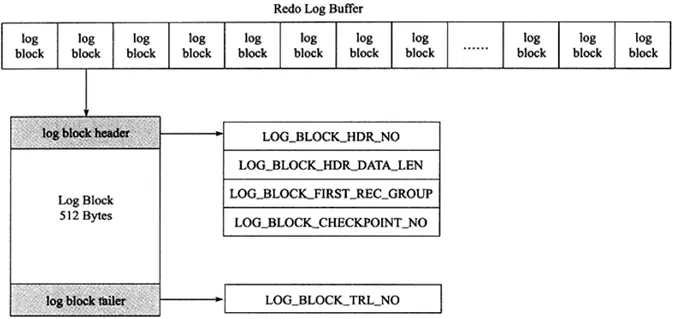

# Redo log

## 存储格式

### block

redo log 包含两部分：一、内存中的日志缓冲（redo log buffer）；二、磁盘上的重做文件（redo log file）。

在 InnoDB 引擎中，redo log 以块作为单位进行存储，这样的块叫做 redo log block，每个块占用 512 byte。不管是 redo log buffer 还是 redo log file，都是以这样的方式进行存储的。

每个 redo log block 由三部分组成：日志块头（12 byte）、日志块尾（8 byte）和日志主体（492 byte），如图所示。




其中，log block header 又包括四部分：

- LOG_BLOCK_HDR_NO

  在 redo log buffer 中的位置 ID。

- LOG_BLOCK_HDR_DATA_LEN

  已经记录的 log 大小。

- LOG_BLOCK_FIRST_REC_GROUP

  第一个 log 的开始偏移位置。

  此处需要解释一下：因为有时候一个数据页产生的日志量超出了一个日志块，所以只能用多个日志块来记录该页的相关日志。例如，某一数据页产生了`552`字节的日志量，那么需要占用两个日志块，第一个日志块占用`492`字节，第二个日志块需要占用`60`个字节，那么对于第二个日志块来说，它的第一个log的开始位置就是`73`字节(60字节内容+12字节头部)。

- LOG_BLOCK_CHECKPOINT_NO

  写入检查点的信息

redo log  buffer 或者 redo log file  由很多 block 组成，如图：




log group 表示的是 redo log group，一个组内由多个大小完全相同的redo log file组成。组内 redo log file 的数量由变量 `innodb_log_files_group` 决定，默认值为 2，即两个 redo log file。**group 是一个逻辑上的概念**。

可以通过下面的命令行进行查看：

```
mysql> show global variables like "innodb_log%";
+-----------------------------+----------+
| Variable_name               | Value    |
+-----------------------------+----------+
| innodb_log_buffer_size      | 8388608  |
| innodb_log_compressed_pages | ON       |
| innodb_log_file_size        | 50331648 |
| innodb_log_files_in_group   | 2        |
| innodb_log_group_home_dir   | ./       |
+-----------------------------+----------+
```

可以看到，结果中显示了相关详细信息，包括 buffer 大小，log_file 的大小，log_file 的数量以及 log file 存放的目录。

进入目录后我们可以看到文件的命名为 ib_logfile0、ib_logfile1...。

InnoDB 存储引擎将 log buffer 中的 block 刷到这些 log_file 中时，会以追加循环的方式进行。

### page

因为 InnoDB 存储引擎中的数据存储单元是 page，所以 redo log 也是基于页进行存储的。默认情况下，InnoDB 页的大小是 16KB。每一个 Page 是由多个 Block 组成的。

## 更新流程

### 脏日志（dirty log）

前面提到，redo log 是由在内存中存在的部分（redo log buffer）和磁盘上存在的部分（redo log file）组成。所以，在更新 redo log 的时候，必然是先更新 redo log buffer，然后同步到 redo log file 进行持久化保存。


从上图可以看出来：在写入事务日志文件时，会先从用户空间的 redo log buffer更新到内核空间中的 OS Buffer 中，然后经过系统调用 fsync，最终刷入磁盘的 log file 中。

当然，每次事务的提交并非一定会刷到磁盘的 log file 中，更新方式可以通过更改变量 `innodb_flush_log_at_trx_commit` 的值进行控制：

- 该值为`1`时，事务每次提交都会立即将 log buffer 中的日志写入 os buffer 中，并调用 fsync 刷到磁盘的 log file
- 该值为`0`时，事务提交时不会立即将 log buffer中日志写入到 os buffer，而是每秒定时写入 os buffer，然后持久化到磁盘中。
- 该值为`2`时，事务每次提交都仅写入 os buffer，然后每秒定时从 os buffer 持久化到磁盘中。


log buffer 中没有持久化到磁盘中的日志称为**脏日志（dirty log）**。

日志刷盘的有以下几种规则：

1. 发出 commit 动作时。由参数 **innodb_flush_log_at_trx_commit**  控制。
2. 每秒刷一次。刷盘频率由 **innodb_flush_log_at_timeout** 值决定，默认为 1 秒。
3. 当log buffer中已经使用的内存超过一半时。
4. 当 checkpoint 需要往前推进时。

### 脏数据（dirty data）

buffer pool 中未刷到磁盘中的数据称为**脏数据（dirty data）**。

前面提到日志刷盘有4条规则，而数据刷盘只有一条规则：checkpoint 触发刷数据。

在 InnoDB 存储引擎中，checkpoint 分为以下两种：

1. sharp checkpoint

   在重用 redo log 文件时，会将所有已经记录的redo log中对应的脏数据刷到磁盘。

2. fuzzy checkpoint

   一次只刷一小部分的日志到磁盘，而非将所有的脏日志刷盘。

## 与 binlog 的区别

binlog 也称为二进制日志，记录了 InnoDB 表的很多操作，也能实现重做功能，但是他们之间还是有一些区别的：

1. 产生位置不同：

   二进制日志是在 Server 层产生的，与存储引擎无关，只要对数据库进行修改就会产生二进制日志；

   redo log 是在 InnoDB 存储引擎产生的，只记录存储引擎中表的修改。

2. 二进制日志是**逻辑性语句**，如记录该行记录的每列的值是多少；redo log 是**物理格式**的日志，它记录的是数据库中每个页的修改。

3. 提交方式不同：

   二进制日志是一次写入的，而 redo log 是两阶段写入的。而且 redo log 会被滚动覆盖。

4. redo log 记录的是物理页的修改情况，具有幂等性（多次操作前后的状态时一直的）。

## 参考资料

1. [详细分析MySQL事务日志(redo log和undo log)](https://juejin.im/entry/5ba0a254e51d450e735e4a1f)