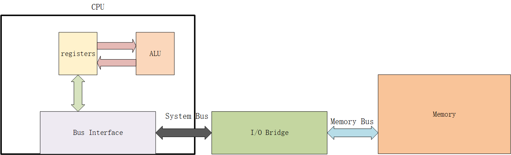

# 存储器学习

## CPU 如何访问主存

比如执行下面一条命令：

movl A, %eax

将地址 A 处的数据加载到寄存器 %eax 中。

在实际的执行过程中总共需要以下几个步骤：

1. CPU 将地址 A 放到 System Bus（系统总线）上
2. I/O Bridge 将信号传递到 Memory Bus（存储器总线）上
3. Memory（主存）感知到 Memory Bus 上的信号，从地址A处取出数据字，并将数据写到 Memory Bus 上
4. I/O Bridge 将该信号翻译成为 System Bus 上的信号，沿着总线传递
5. CPU 感知到System Bus 上的数据，从总线上读数据，并将其写入 %eax 中

## CPU 如何访问磁盘

## 参考资料

1.《深入理解计算机系统（第二版）》