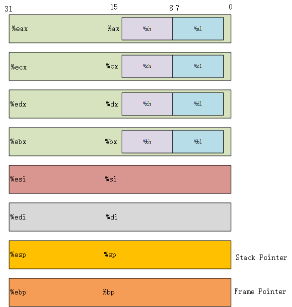

# 机器级程序初步

## 引子

函数调用可以说在任何语言中使用的频次都非常之高了，可是有没有想过函数调用背后的本质是什么？

比如我们看下面几行代码：

```c
int P()
{
	int x = f();//执行一些计算
    Q();
    return x;
}
```

在这段代码中，函数 `P` 调用了函数 `Q`。

背后到底发生了什么呢？

这是一个很长的故事，我们得从汇编语言开始说起。

## 汇编语言

汇编语言是机器代码的文本表示（虽然可读性比不上C语言或者更高级的语言，但至少比读取01机器代码容易多了吧）。


## 指令

机器不认识源代码，只认识字节序列，比如下面就是一段机器可以认识并执行的指令（16进制表示）:

55 89 e5 8b 45 ......

一下是一段比较完整代码的机器字节序列和汇编语言代码的对照表示（16进制）。

| Offset | Bytes             | 汇编语言表示       |
| ------ | ----------------- | ------------------ |
| 0      | 55                | push %ebp          |
| 1      | 89 e5             | mov %esp,%ebp      |
| 3      | 8b 45 0c          | mov 0xc(%ebp),%eax |
| 6      | 03 45 08          | add 0x8(%ebp),%eax |
| 9      | 01 05 00 00 00 00 | add %eax,0x0       |
| f      | 5d                | pop %ebp           |
| 10     | c3                | ret                |

Offset 一列代表字节序列的相对地址偏移，Bytes 一列代表机器真正执行的字节序列。

以 IA-32 为例，它认识的指令长度从1到15字节不等，字节和机器指令是一一对应的，比如只有 `push %ebp` 这个指令是以字节 55 开头的。

大多数指令都有一个操作数（operand），用来指示一个操作中要引用的**源数据值**，以及放置结果的**目标位置**。

操作数形式可以分为三种：

1. 立即数，也就是常数值，可以将32位的立即数直接放置到一个寄存器中

2. 寄存器，表示某个寄存器的内容。

3. 存储器引用。

   会根据计算出来的地址访问某个存储器的位置。

#### 寻址方式

下面表格列出了常用的几种寻址方式，Ea 表示任意寄存器a，R[Ea]表示该寄存器的值，M[Addr]表示对存储器中地址 Addr 开始的b个字节的引用。

| 类型   | 格式         | 操作数值               | 名称            |
| ------ | ------------ | ---------------------- | --------------- |
| 立即数 | $Imm         | Imm                    | 立即数寻址      |
| 寄存器 | Ea           | R[Ea]                  | 寄存器寻址      |
| 存储器 | Imm          | M[Imm]                 | 绝对寻址        |
| 存储器 | (Ea)         | M[R[Ea]]               | 间接寻址        |
| 存储器 | Imm(Eb)      | M[Imm+R[Eb]]           | 基址+偏移量寻址 |
| 存储器 | (Ea,Eb)      | M[R[Ea]+R[Eb]          | 变址寻址        |
| 存储器 | Imm(Ea,Eb)   | M[Imm+R[Ea]+R[Eb]]     | 变址寻址        |
| 存储器 | (,Ea,s)      | M[R[Ea]*s]             | 比例变址寻址    |
| 存储器 | Imm(,Ea,s)   | M[Imm+R[Ea]*s]         | 比例变址寻址    |
| 存储器 | (Ea,Eb,s)    | M[R[Ea]+R[Eb]*s]       | 比例变址寻址    |
| 存储器 | Imm(Ea,Eb,s) | M[Imm + R[Ea]+R[Eb]*s] | 比例变址寻址    |

#### 数据传送

该指令是将一个位置的数据复制到另一个位置，是最频繁使用的指令。

## 寄存器

一个 IA-32 CPU包含一组 8 个存储 32 位值的寄存器。

这些寄存器用来存储整数数据和指针。



字节操作指令可以独立读写前 4 个寄存器的 2 个低位字节。


1. 程序计数器

   在IA-32中，通常称为PC，使用 `%eip` 表示，在该寄存器中存储的是将要执行的下一条指令在寄存器的地址。

2. 整数寄存器

   用来存储地址或者整数数据。

3. 条件码寄存器

   保存最近执行的算术或者逻辑指令的状态信息，他们用来实现控制或者数据流中的条件变化。

4. 浮点寄存器

   存放浮点数据。


## 栈和帧


## 参考资料

1. 《深入理解计算机系统（第二版）》第三章